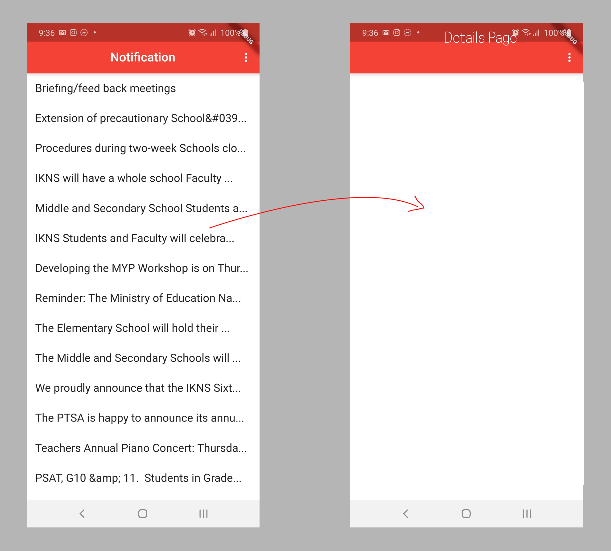

# flutter-list
JSON Data with Refresh Indicator and List Detials Page




```
import 'package:flutter/foundation.dart';
import 'package:flutter/material.dart';
import 'dart:async';
import 'dart:convert';
import 'package:http/http.dart' as http;

class Todo {
  final String title;
  final String description;

  Todo(this.title, this.description);
}

void main() {
  runApp(MaterialApp(
    title: 'Passing Data',
    home: TodosScreen(
      
      
      todos: List.generate(
        20,
        (i) => Todo(
          'Todo $i',
          'A description of what needs to be done for Todo $i',
        ),
      ),
 
 
    ),
  ));
}

class TodosScreen extends StatefulWidget {
  
  
  final List<Todo> todos;

  TodosScreen({Key key, @required this.todos}) : super(key: key);

  @override
  _TodosScreenState createState() => _TodosScreenState();
}

class _TodosScreenState extends State<TodosScreen> {

   final String url = "https://ikns.info/api/announcement_data.php";
  List data;
 Future<String> getSWData() async {
    refreshKey.currentState?.show(atTop: false);
    //await Future.delayed(Duration(seconds: 2));
    var res = await http.get(Uri.parse(url), headers: {"Accept": "application/json"});


      if (mounted) {
        setState(() {
        data = json.decode(res.body); 
        });
      }


    return null;
  }

    var refreshKey = GlobalKey<RefreshIndicatorState>();


    @override
    void initState() {
      super.initState();
        this.getSWData();
    }

    //initialize the icon in appbar
    Icon actionIcon = new Icon(Icons.more_vert);


  @override
  Widget build(BuildContext context) {
   return new Scaffold(
      backgroundColor: Colors.white,
      appBar: new AppBar(
          centerTitle: true,  //centering the title
          title: new Text('Notification', style: TextStyle(color: Colors.white)),
          backgroundColor: Colors.red,
          actions: <Widget>[
            new IconButton(
              icon: actionIcon,
              onPressed:(){
                  Navigator.of(context).pushNamed('emailRoute');
              },
            ),
          ],
        ),
      

      body: RefreshIndicator(
        key: refreshKey,
        

        child: ListView.builder(
   

           itemCount: data == null ? 0 : data.length,
            itemBuilder: (BuildContext context, int index) {
          return Container(
            child: Center(
              child: Column(
                crossAxisAlignment: CrossAxisAlignment.stretch,
                children: <Widget>[
                   Container(
                        padding: EdgeInsets.all(15.0),
                        child: Row(
                          children: <Widget>[
                            Text(data[index]["title"],
                                style: TextStyle(
                                    fontSize: 18.0, color: Colors.black87)),
                          ],
                        )),
                ],
              ),
            ),
          );
        },
        ),

        onRefresh: getSWData,
      ),
    );
  }
}

```

